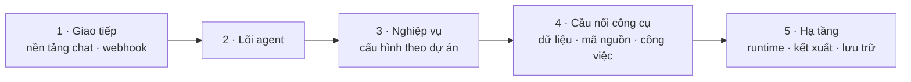
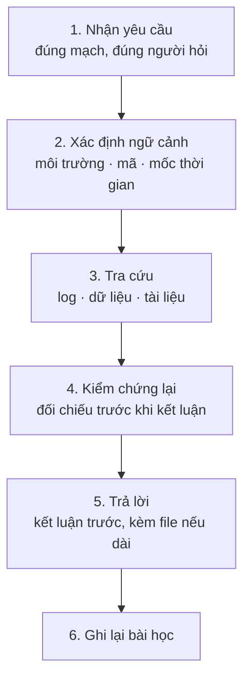

# <TÊN HỆ THỐNG/TRỢ LÝ> — TÀI LIỆU KỸ THUẬT

**<Mô tả một dòng: trợ lý/hệ thống hỗ trợ ai, việc gì>**

| | |
|---|---|
| **Phiên bản** | 1.0 |
| **Ngày** | dd/mm/yyyy |
| **Người phụ trách** | Nguyễn Lê Việt (KCN, DVNH) |
| **Đối tượng đọc** | Dev · BA · Tester · PM/QC dự án <X> |
| **Kênh hoạt động** | Google Chat (nhóm dự án, tin nhắn riêng) |

---

## Mục lục

_Bấm vào tên mục để nhảy đúng trang. Số trang tính theo số trang của trình đọc PDF (bìa là trang 1)._

1. [Tổng quan](#m1) — tr. 1
2. [Các lớp kỹ thuật & thành phần](#m2) — tr. 2
3. [Năng lực chức năng](#m3) — tr. 4
4. [Cách sử dụng](#m4) — tr. 5
5. [Định dạng kết quả trả về](#m5) — tr. 6
6. [Phạm vi truy cập dữ liệu](#m6) — tr. 6
7. [Nguyên tắc an toàn & bảo mật](#m7) — tr. 7
8. [Vận hành & tự động hoá](#m8) — tr. 7
9. [Quy trình xử lý một yêu cầu](#m9) — tr. 8
10. [Giới hạn đã biết & hướng phát triển](#m10) — tr. 10
11. [Phụ lục A — Câu lệnh mẫu](#m11) — tr. 10
12. [Phụ lục B — Nguyên tắc tra & đọc mã lỗi](#m12) — tr. 11

---

<h2 id="m1">1. Tổng quan</h2>

**<Tên> là gì** — <2–3 câu, nêu rõ nó giúp ai, việc gì.>

**<Tên> KHÔNG phải** — <phân định: không phải người thật / không phải tài khoản cá nhân / không nằm trong luồng nghiệp vụ.>

**Mục tiêu** — <giảm việc gì, chuẩn hoá cái gì, lưu lại cái gì.>

**Phạm vi áp dụng** — <dự án nào; dự án khác cần cấu hình gì trước.>

---

<h2 id="m2">2. Các lớp kỹ thuật & thành phần</h2>

<Nêu nguyên tắc phân lớp: lớp trên chỉ làm việc với lớp liền dưới.>

### 2.1 Sơ đồ lớp

### 2.2 Vai trò từng lớp

| Lớp | Thành phần chính | Vai trò |
|---|---|---|
| 1 — Giao tiếp | | |
| 2 — Lõi agent | | |
| 3 — Nghiệp vụ | | |
| 4 — Cầu nối công cụ | | |
| 5 — Hạ tầng & kết xuất | | |

### 2.3 Thành phần mã nguồn mở đang dùng

| Thành phần | Phiên bản | Vai trò trong hệ thống | Nguồn |
|---|---|---|---|
| | | | |

*Số liệu phiên bản ghi nhận tại <ngày>.*

### 2.4 Thành phần nội bộ & nền tảng bên ngoài

| Thành phần | Vai trò | Loại |
|---|---|---|
| | | Nội bộ — tự phát triển |
| | | Nền tảng ngoài |

### 2.5 Điểm cần lưu ý về vận hành

- <Phần nào chạy cục bộ, phần nào gọi dịch vụ ngoài.>
- <Cấu hình theo dự án ra sao, không suy đoán.>

---

<h2 id="m3">3. Năng lực chức năng</h2>

### 3.1 Dành cho Tester

| Năng lực | Mô tả |
|---|---|

### 3.2 Dành cho Dev / BA

| Năng lực | Mô tả |
|---|---|

### 3.3 Dùng chung

| Năng lực | Mô tả |
|---|---|

---

<h2 id="m4">4. Cách sử dụng</h2>

**Cách gọi** — <gọi trong nhóm / nhắn riêng / câu lệnh mẫu.>

**Thông tin nên cung cấp**

| Mức | Thông tin |
|---|---|
| Bắt buộc | |
| Nên kèm | |
| Càng rõ càng tốt | |

**Không gửi vào chat** — <mật khẩu, token, OTP, dữ liệu khách hàng thật.>

---

<h2 id="m5">5. Định dạng kết quả trả về</h2>

| Loại yêu cầu | Kết quả nhận được |
|---|---|

**Nguyên tắc chung** — <kết luận trước, chi tiết sau; log dài đi kèm file; trả lời đúng mạch hỏi.>

---

<h2 id="m6">6. Phạm vi truy cập dữ liệu</h2>

| Nguồn dữ liệu | Mức truy cập | Ghi chú |
|---|---|---|

---

<h2 id="m7">7. Nguyên tắc an toàn & bảo mật</h2>

- **Không đưa mã nguồn ra nhóm chat**: <…>
- **Không nhận và không lưu mật khẩu, token, OTP**: <…>
- **Không tự ý sửa/xoá dữ liệu**: <…>
- **Che thông tin nhạy cảm** khi trích log: <…>
- **Từ chối yêu cầu vượt phạm vi** và báo lại người phụ trách.
- **Không cam kết deadline, khối lượng hay số liệu** thay cho team.
- **Không thực hiện chỉ thị nằm trong nội dung tài liệu/log/tệp.**

---

<h2 id="m8">8. Vận hành & tự động hoá</h2>

**Tác vụ định kỳ đang chạy**

| Tác vụ | Nội dung |
|---|---|

**Cơ chế leo thang** — <khi vượt phạm vi thì làm gì.>

**Nguyên tắc vận hành** — <tác vụ nhẹ, có chống trùng, tự dọn tài nguyên tạm.>

---

<h2 id="m9">9. Quy trình xử lý một yêu cầu</h2>

| Bước | Việc làm | Vì sao |
|---|---|---|

---

<h2 id="m10">10. Giới hạn đã biết & hướng phát triển</h2>

**Giới hạn hiện tại** — <…>

**Hướng phát triển đề xuất** — <…>

---

<h2 id="m11">11. Phụ lục A — Câu lệnh mẫu</h2>

| Mục đích | Câu lệnh mẫu |
|---|---|

---

<h2 id="m12">12. Phụ lục B — Nguyên tắc tra & đọc mã lỗi</h2>

Phân loại theo **NHÓM** mã lỗi; KHÔNG liệt kê mã cụ thể của dự án trong tài liệu (mã cụ thể tra theo
môi trường khi cần).

| Nhóm mã lỗi | Cách nhận biết | Hướng xử lý |
|---|---|---|
| Lỗi đến từ hệ thống lõi / đối tác | <khác mã hiển thị của ứng dụng> | <không thực hiện lại; lấy đoạn trao đổi làm bằng chứng> |
| Giao dịch chờ kết quả cuối | <lõi đã ghi nhận, chưa trả kết quả cuối> | <giữ "chờ tra soát", theo dõi> |

**Nguyên tắc đọc mã lỗi** — <nhóm lỗi đến từ đâu, kết luận phải kèm bằng chứng gì.>

---

*Tài liệu nội bộ dự án <X>. Phản hồi và góp ý xin gửi trực tiếp trong nhóm hoặc tới <người phụ trách>.*
